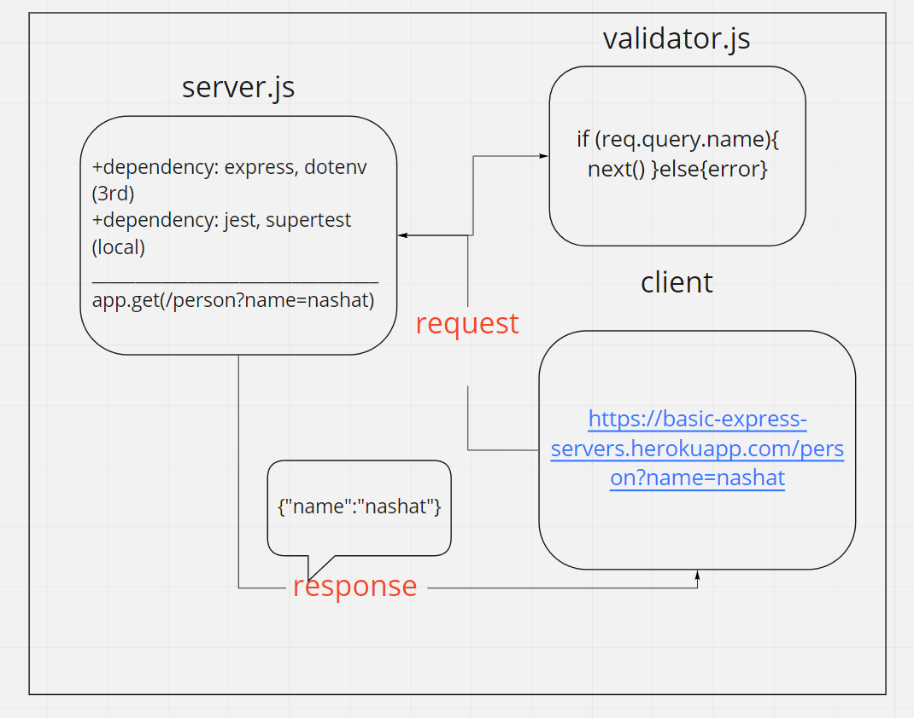

# basic-express-server

### Author : Nashat Alzaatreh

## install

1. copy the link of the repo
1. clone the repo on your local machine by `git clone repo-url`
1. download independencies by `npm i`
1. create a `.env`, then cope the content of `.env.sample` file inside the `.env` file.
1. fill the variables of `.env`
1. run the app

## Deploy, Run and Test

- [test report](./src/testReport.PNG)
- [deployed link](https://basic-express-servers.herokuapp.com/)
- [Pull Request](https://github.com/NashatAlzaatreh/basic-express-server/pull/1)

### Setup

#### `.env` requirement

- `PORT` - port number

#### Running the app

- either:
  1. `npm start`
  1. `nodemon` (npm run dev)
- Endpoint: `https://basic-express-servers.herokuapp.com/person?name=nashat`
  - returns Object

```javascript
{"name":"nashat"}
```

#### Test

- Unit test: `npm run test`
- Lint test: `npm run lint`

### UML:


